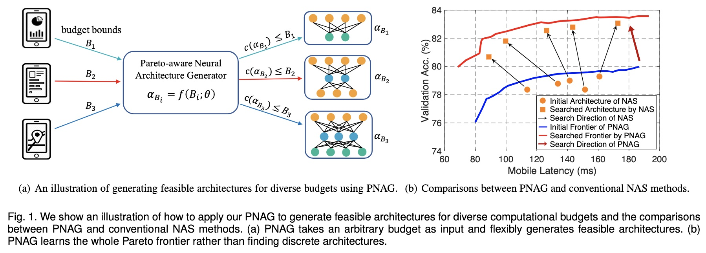

# Pareto-aware Neural Architecture Generation for Diverse Computational Budgets


## Introduction


Designing feasible and effective architectures under diverse computational budgets, incurred by different applications/devices, is essential for deploying deep models in real-world applications. To achieve this goal, existing methods often perform an independent architecture search process for each target budget, which is very inefficient yet unnecessary. More critically, these independent search processes cannot share their learned knowledge (i.e., the distribution of good architectures) with each other and thus often result in limited search results. To address these issues, we propose a Pareto-aware Neural Architecture Generator (PNAG) which only needs to be trained once and automatically produces the Pareto optimal architecture for any given budget via inference. To train PNAG, we learn the whole Pareto frontier by jointly finding multiple Pareto optimal architectures under diverse budgets. Such a joint search algorithm not only greatly reduces the overall search cost but also improves the search results. Extensive experiments on three hardware platforms (i.e., mobile device, CPU, and GPU) show the superiority of our method over existing methods.


<p align="center">

</p>


## Requirements

Please install all the requirements in `requirements.txt`.

## Data preparation

Download and extract ImageNet train and val images from http://image-net.org/.
The directory structure is the standard layout for the torchvision [`datasets.ImageFolder`](https://pytorch.org/docs/stable/torchvision/datasets.html#imagefolder), and the training and validation data is expected to be in the `train` folder and `val` folder respectively:

```
/path/to/imagenet/
  train/
    class1/
      img1.jpeg
    class2/
      img2.jpeg
  val/
    class1/
      img3.jpeg
    class/2
      img4.jpeg
```

## Training Method

We apply our PNAG to produce architectures under diverse latency budgets evaluated on three hardware platforms, including:

- a mobile device (Qualcomm Snapdragon 821 processor)
- a CPU processor (Intel Core i5-7400)
- a GPU card (NVIDIA TITAN X)

We have collect the validation accuracy and the latency of 16,000 architectures in the file (`data/architectures.json`).


Train PNAG to satisfy diverse mobile latencies.
```
bash entry/search_on_mobile.sh /path/to/imagenet
```

Train PNAG to satisfy diverse GPU latencies.
```
bash entry/search_on_cpu.sh /path/to/imagenet
```

Train PNAG to satisfy diverse GPU latencies.
```
bash entry/search_on_gpu.sh /path/to/imagenet
```


## Model Zoo (Evaluation)


<p align="center">

</p>


 #### Pretrained Models

We have released our PNAG [pretrained model](https://github.com/guoyongcs/PNAG/releases/tag/weights) on ImageNet. 

You can use the following scripts to load the pretrained models:

```
import torch
model = torch.hub.load("guoyongcs/PNAG", "pnag-cpu-30")
```

The names of all the available models are listed below

```
['pnag_cpu_30', 'pnag_cpu_35', 'pnag_cpu_40', 'pnag_cpu_45', 'pnag_cpu_50', 
'pnag_gpu_90', 'pnag_gpu_115', 'pnag_gpu_140', 'pnag_gpu_165', 'pnag_gpu_190', 
'pnag_mobile_80', 'pnag_mobile_110', 'pnag_mobile_140', 'pnag_mobile_170', 'pnag_mobile_200',]
```

#### Evaluating Models on ImageNet

We also provide a script to evaluate the pretrained models on ImageNet and report the accuracy.

```
python -m entry.eval /path/to/imagenet
```

- Results for mobile latency budgets:

| Method           | Latency (ms) | #MAdds (M) | Acc@1 |
|------------------|:----:|:-----:|:-----------:|
| PNAG-80-Mobile | 79.9 | 349 |     78.3     |
| PNAG-110-Mobile | 106.8 | 451 | 79.4    |
| PNAG-140-Mobile | 127.8 | 492 | 79.8    |
| PNAG-170-Mobile | 167.1 | 606 | 80.3    |
| PNAG-200-Mobile | 193.9 | 724 | 80.5   |

- Results for CPU latency budgets:

| Method           | Latency (ms) | #MAdds (M) | Acc@1 |
|------------------|:----:|:-----:|:-----------:|
| PNAG-30-CPU | 29.7 | 335 | 78.3    |
| PNAG-35-CPU | 34.5 | 431 | 79.4    |
| PNAG-40-CPU | 39.6 | 502 | 79.8    |
| PNAG-45-CPU | 44.7 | 620 | 80.2    |
| PNAG-50-CPU | 48.9 | 682 | 80.5    |

- Results for GPU latency budgets:

| Method           | Latency (ms) | #MAdds (M) | Acc@1 |
|------------------|:----:|:-----:|:-----------:|
| PNAG-90-GPU | 86.9 | 310 | 78.3    |
| PNAG-115-GPU | 111.2 | 411 | 79.3    |
| PNAG-140-GPU | 138.9 | 510 | 79.7    |
| PNAG-165-GPU | 162.7 | 582 | 80.3    |
| PNAG-190-GPU | 185.5 | 640 | 80.4    |

