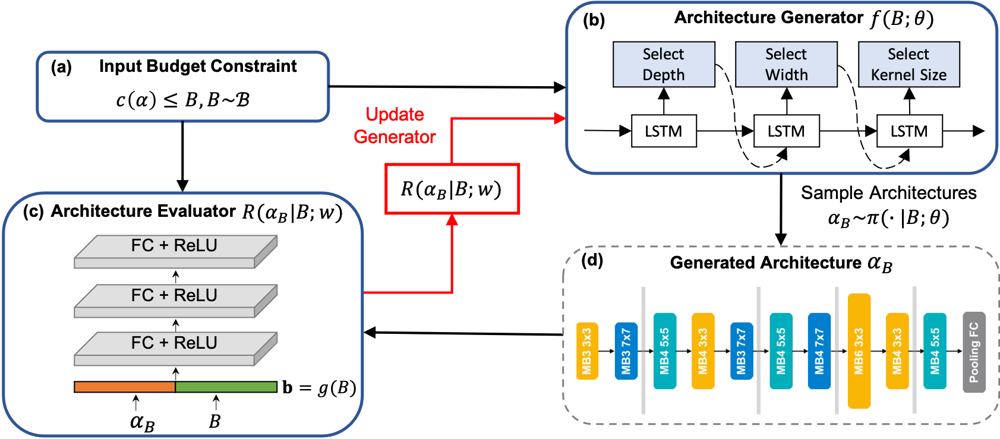

# Pareto-aware Neural Architecture Generation for Diverse Computational Budgets

Pytorch Implementation for "Pareto-aware Neural Architecture Generation for Diverse Computational Budgets".

## Requirements

Please install all the requirements in `requirements.txt`.

## Training Method

TODO

