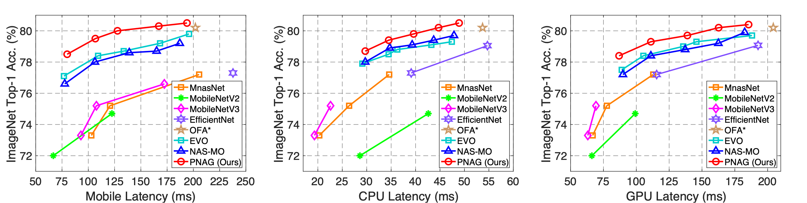

# Pareto-aware Neural Architecture Generation for Diverse Computational Budgets


## Introduction

Designing feasible and effective architectures under diverse computational budgets, incurred by different applications/devices, is essential for deploying deep models in practice.
To achieve this goal, existing methods often perform an independent architecture search process for each target budget, which is very inefficient yet unnecessary.
More critically, these independent search processes cannot share their learned knowledge (i.e., the distribution of good architectures) with each other and thus often result in limited search results.
To address these issues, we propose a Pareto-aware Neural Architecture Generator (PNAG) which only needs to be trained once and automatically produces the Pareto optimal architecture for any given budget via inference (See Figure 1 (a)).
To train the PNAG, we learn the whole Pareto frontier by jointly finding multiple Pareto optimal architectures under diverse computational budgets (See Figure 1 (b)). 
Such a joint search algorithm not only greatly reduces the overall search cost but also improves the search performance.
Extensive experiments on three platforms (i.e., mobile device, CPU, and GPU) show the superiority of our method over existing methods.

<p align="center">

</p>


<p align="center">
<i>
Figure 1.
An illustration of how to apply our PNAG to generate feasible architectures for diverse computational budgets (a) and the comparisons between PNAG and conventional NAS methods (b). (a) PNAG takes an arbitrary budget as input and flexibly generates feasible architectures.
(b) PNAG learns the whole Pareto frontier rather than finding discrete architectures.
</i>
</p>

## Performance Results

We compare PNAG with state-of-the-art methods on mobile device (Snapdragon 821), CPU devices (i5-7400), and GPU devices (NVIDIA TITAN X GPU). 
From Figure 2, our PNAG consistently achieves higher accuracy than other methods. 
PNAG outperforms state-of-the-art architectures under different latency budgets. 
Specifically, given any latency budget, the architectures generated by PNAG consistently yield better performance than the considered baseline methods, including OFA and OFA-MO.
More critically, our PNAG only need to search once to produce promising architectures that satisfy different latency budgets accordingly, while previous methods need to repeat the search process according to different budgets.
These results show the effectiveness of our PNAG on three considered devices.

<p align="center">

</p>


<p align="center">
<i>
Figure 2.
Comparisons of the architectures obtained by different methods on mobile, CPU and GPU devices.
</i>
</p>

## Requirements

Please install all the requirements in `requirements.txt`.

## Datasets

We consider a large-scale benchmark classification datsets, namely ImageNet.

ImageNet needs to be manually downloaded (preferably to a SSD) and preprocessed following the [instructions](https://github.com/pytorch/examples/tree/master/imagenet).

## Training Method

We have collect the validation accuracy, the latency on CPU (Intel i5-7400), GPU (NVIDIA TITAN X) and mobile phone (equipped with a Qualcomm Snapdragon 821 processor) of 16,000 architectures in the file (`data/architectures.json`).
The following scripts will search architectures with the collected data.

Script to search on CPU platform.
```
bash search_on_cpu.sh /path/to/imagenet
```

Script to search on GPU platform.
```
bash search_on_gpu.sh /path/to/imagenet
```

Script to search on mobile platform.
```
bash search_on_mobile.sh /path/to/imagenet
```

## Validating Method
